# Roots of the FrontEnd

*By Sachin Dixit*

## Today's Web Architecture

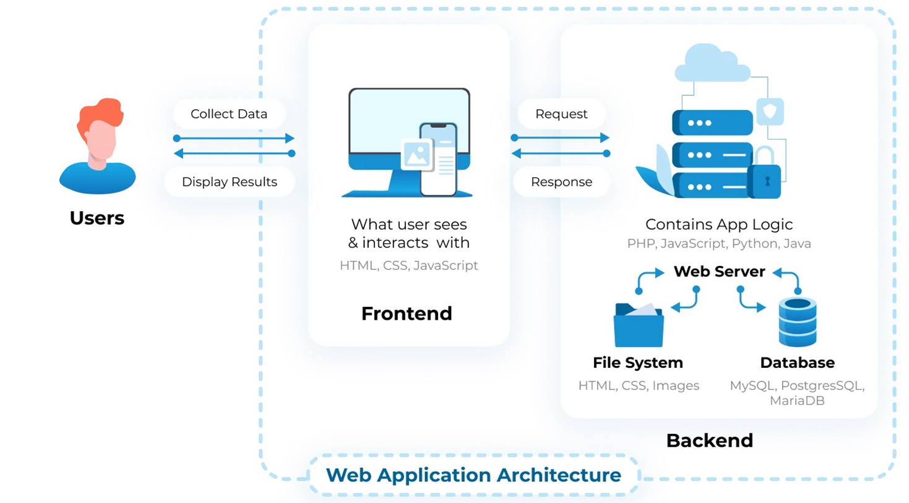

- Scale
- Uptime
- Cost Efficiency
- Faster Response
- Ease of Integration
- Consistency
- Observability
- Security
- Extensible

## What is Internet

- Email
- Ftp
- Telnet
- Usenet news
- & WWW
- Is internet client server or peer to peer ?
- Dark net ?

## WWW

- Popular method of access internet
- Works on hyper text ( what is hypertext ?)
- Hypertext document on internet are known as web pages !
- Hypermedia ?
- Hyper link [ what is normal link then ? ]
- Web pages are created using language called as HTML
- "Web" browser [ File browser ? ]
- Notion of U R L
- MIME Types

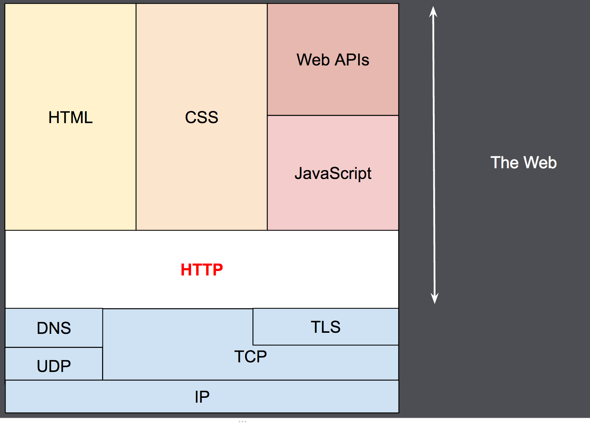

## Http

- Stateless vs Sessionless
- Request -Response -Headers
- Cookies and regulations !!
- CSP-CORS-Vulnerabilities
- APIs : XMLHttpRequest, Fetch

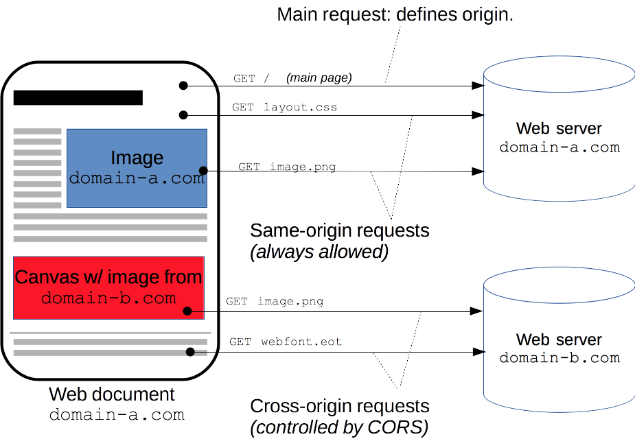

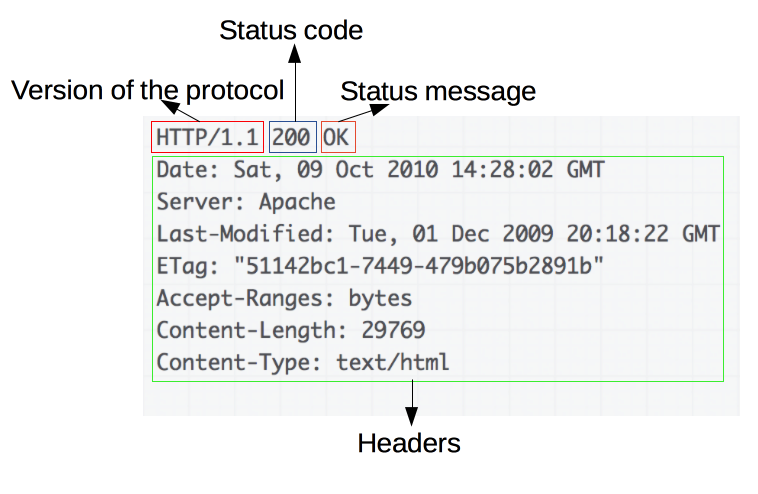

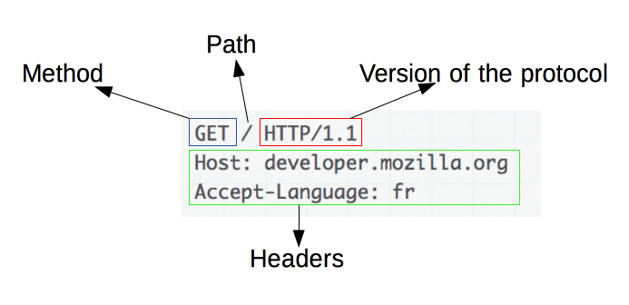

## Http Evolutions

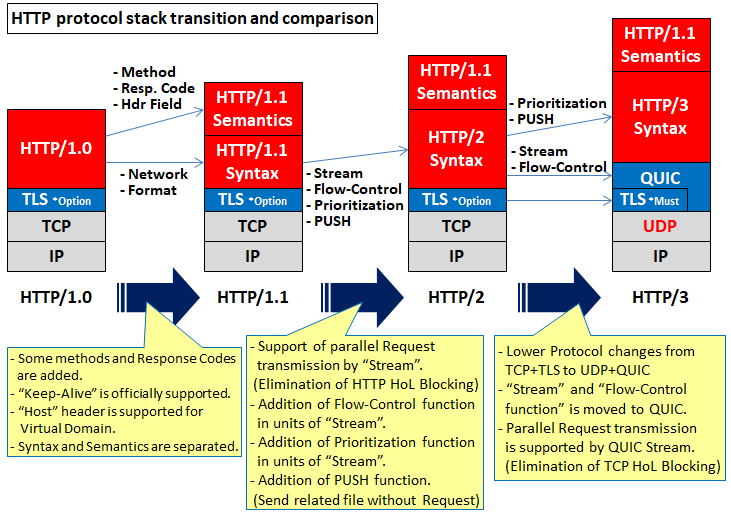

Image via: <https://milestone-of-se.nesuke.com/en/l7protocol/http/http3-over-quic/>

## Http offshoots

- SSL/TLS
- PKI
- Websocket
- webDAV
- REST
- RSS, ATOM
- Vulnerabilities guides: <https://infosec.mozilla.org/guidelines/web_security> <https://owasp.org/www-project-top-ten/>
- Evolution of web: <http://www.evolutionoftheweb.com/>

## Browsers

- Components : Own UI, Engines, Networking, JS Engines, Storages, Plugins
- Engines : Trident, Webkit, Gecko
- Multiple Specs support
- History <https://blog.mozilla.org/en/internet-culture/deep-dives/why-are-hyperlinks-blue>

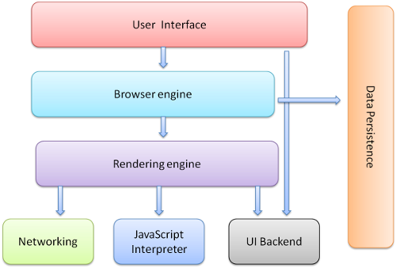

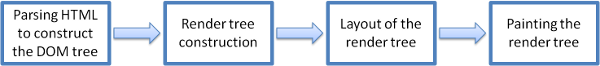

Images via <https://www.html5rocks.com/en/tutorials/internals/howbrowserswork/>

## The Rendering

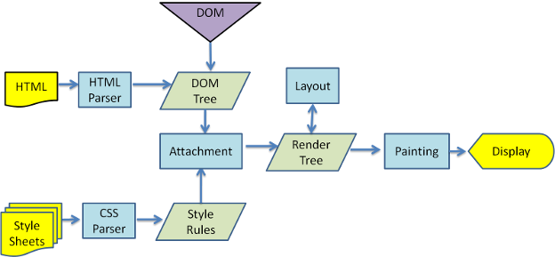

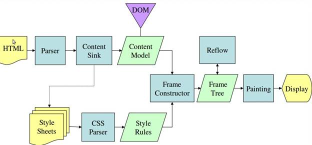

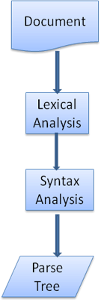

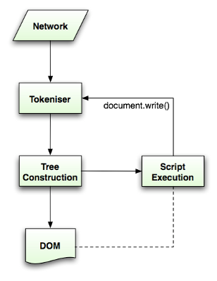

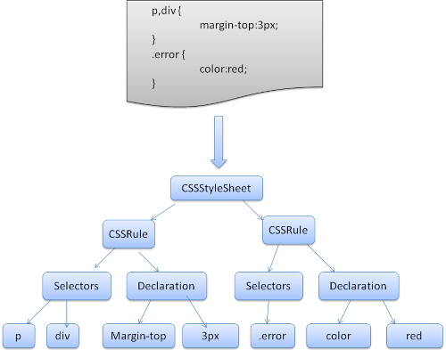

## HTML

- HTML ⇒ Structure, CSS ⇒ Presentation, JS ⇒ Behaviour
- Links, Documents, Tags, Resources
- UI elements, validations,
- Animations, Accessibility
- MultiMedia tags
- Storage : Webstorage, IndexedDB
- Service workers, PWA
- FORM as element of interaction

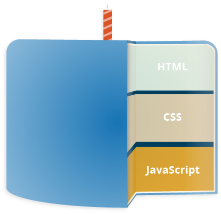

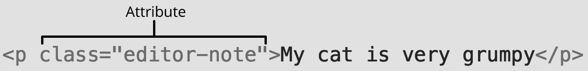

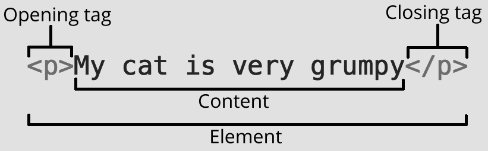

## CSS

- Style-Sheet
- Cascading, Inheritance
- Selectors-specificity : Universal(*), Elements, Type, ID, Class, Attribute, Pseudo-class, combinators
- Font, color(RGB, HSL, hex, CMYK), space, sizes(pixel, %, em), viewport
- Tables - Divs
- Box : FlexBox, Grids, Floats, Layouts, Animations
- RWD, media query
- CSS versions, Browser compatibility

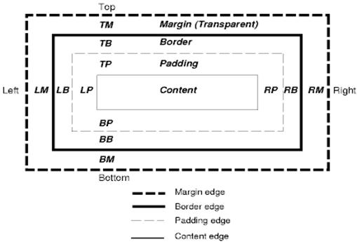

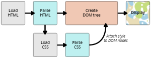

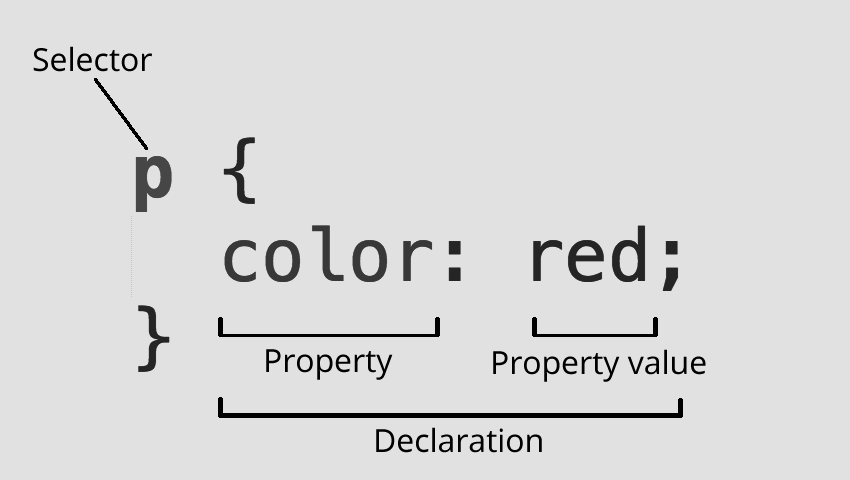

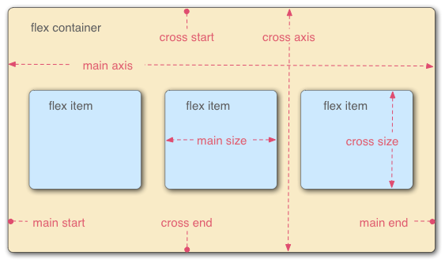

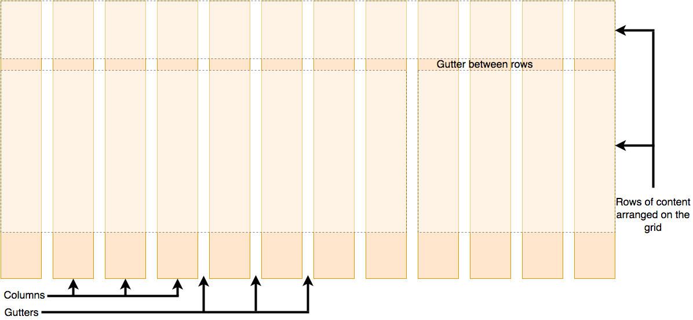

## JS

- Dynamic programming language for browser (& nodejs), Single threaded, Interpreted, functional, Object based
- Basic programming constructs
- Events, REPL, Async
- JSON !!
- Browser APIs: DOM, XMLHttpRequest, Geolocation, Canvas, Storage, ServiceWorkers, WebGL, WebRTC, Codes
- Versions : ES16, ES20

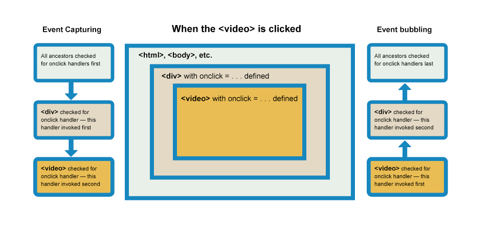

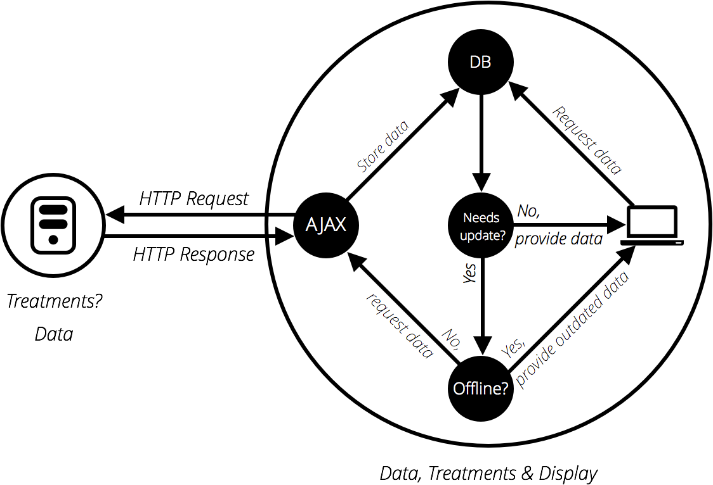

## Document and server pages

- Applet, Flash
- Active pages : JSP / ASP
- JSF, Portlet
- JSP : Taglibs, EL

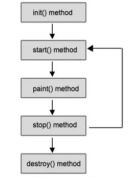

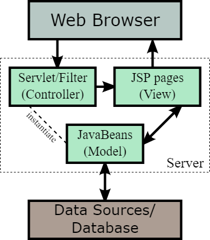

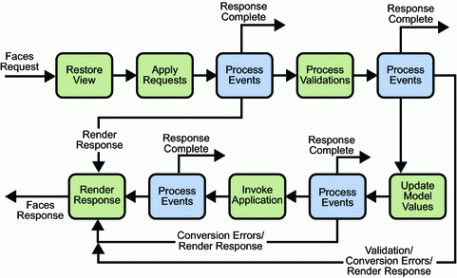

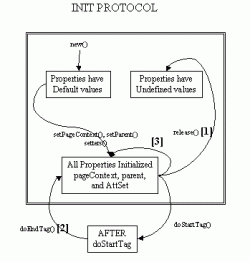

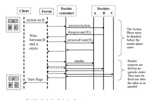

## AJAX and Jquery

- What ajax enabled
- The achievement of jQuery
- Dichotomy of layout vs event

## Componentization of web

- Ext and Angular.js what problem they set out to solve
- Routing
- Binding
- Layout
- Components (lifecycles )
- Styling
- Modules
- Menu
- Templates

| Framework | Browser support | Preferred DSL | Supported DSLs |
| --- | --- | --- | --- |
| Angular | IE9+ | TypeScript | HTML-based; TypeScript |
| React | Modern (IE9+ with Polyfills) | JSX | JSX; TypeScript |
| Vue | IE9+ | HTML-based | HTML-based, JSX, Pug |

## Popular UI libraries

- How each library solved the problem
- Angular - react - vue - polymer
- Ethical web design principles : <https://www.w3.org/TR/design-principles/#one-time-events>

## Angular

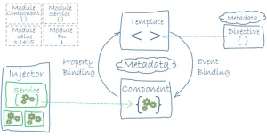

## Vue

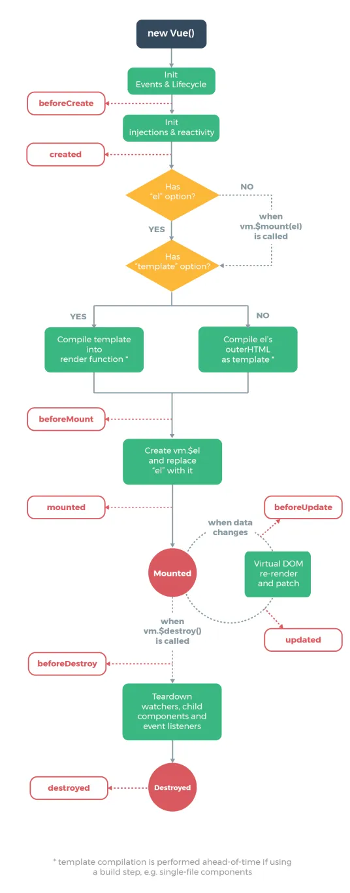
